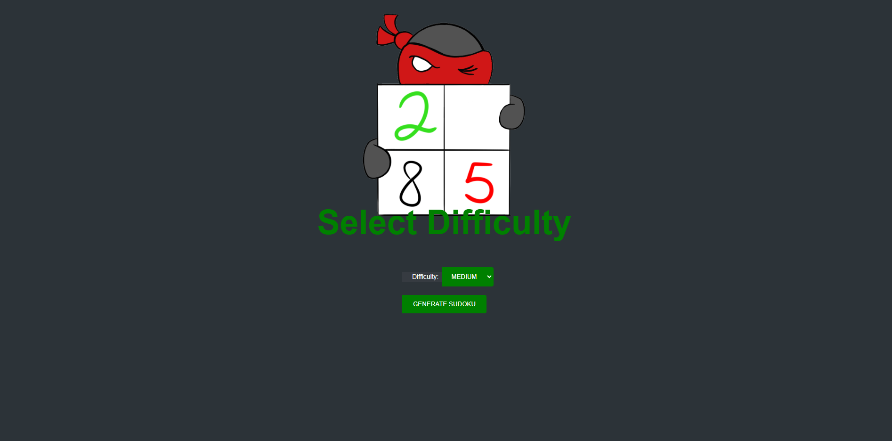
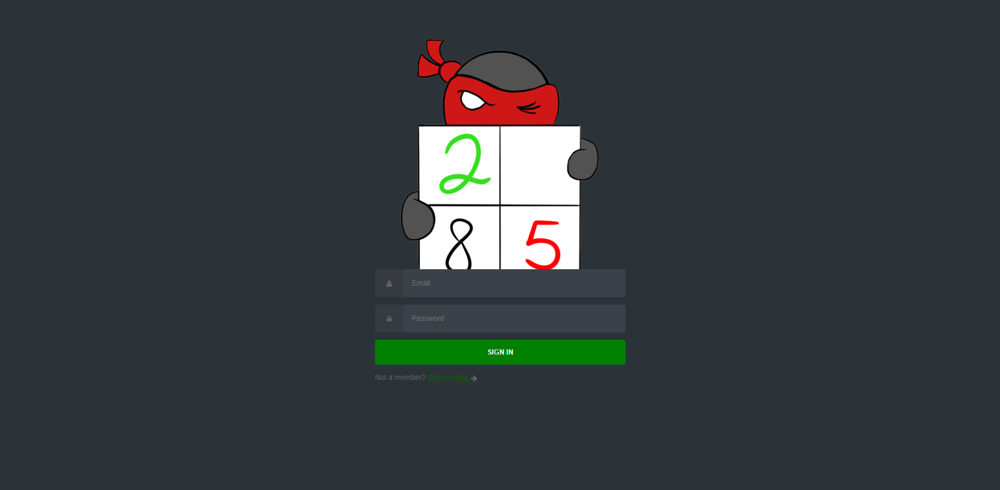
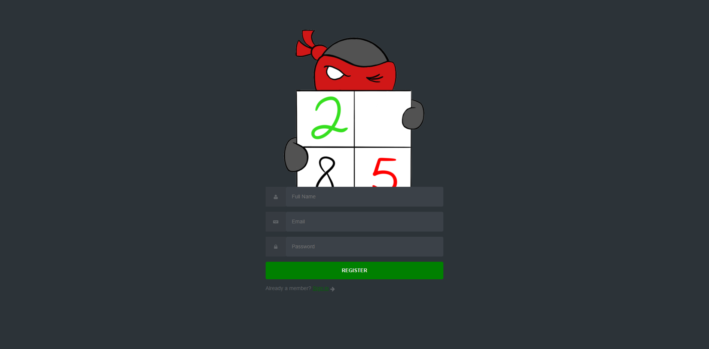

# Persudoku

This is Persudoku. a personal Sudoku generator!
If you are passionate about Sudoku I recommand you to try it!

## Features
### Home

<div align="center"></div>

The index page  gives you a menu with difficulty options to generate a Sudoku game

### Login

<div align="center"></div>

You need to create a user before you can start playing our awesome game.
If you still don't have a user your more then welcome to register into our community in the button at the bottom of the page

### Register

<div align="center"></div>

Here you can register for the first time so we can get to know each other a little

### Sudoku

<div align="center"></div>

After you created a user and registered to our website in the home page you can choose a difficulty and start playing right over here!


## Technology Stack

My project features a wide set of technologies and tools to ensure a high-quality application, with continuous integration, and robust deployment practices. Below, you'll find a detailed overview of our tech stack, emphasizing our DevOps processes:

### Continuous Integration and Delivery

- **Jenkins**: An open-source automation server that enables developers around the world to reliably build, test, and deploy their software. Jenkins orchestrates our CI/CD pipeline, integrating seamlessly with GitHab for a smooth development process. in this project used with a pipeline to run different CI pipelines for testing the functions of my app with Pytest building my image to dockerhub and then for CD to sync my app's image with ArgoCD. Ive created my Jenkins pipeline in a Helmchart I created and is deployed with the helpof ArgoCD
  - <div align="center"></div>

### Containerization and Artifact Storage

- **Docker Hub**: A service provided by Docker for finding and sharing container images in a public repository. I've use Docker Hub to store and manage my application's artifacts securely. In Dockerhub I store images for: my app, 
  - <div align="center"></div>

### Deployment

- **ArgoCD**: A declarative, GitOps continuous delivery tool for Kubernetes. ArgoCD automates the deployment of applications to various environments, ensuring that our production environment is always up to date with the latest stable version of our application.
  - <div align="center"></div>

### Monitoring

- **Grafana**: An open-source platform for monitoring and observability. Grafana allows us to query, visualize, alert on, and understand our metrics no matter where they are stored. It provides tools to turn our time-series database (TSDB) data into beautiful graphs and visualizations.
  - <div align="center"></div>

- **Prometheus**: An open-source systems monitoring and alerting toolkit. We use Prometheus alongside Grafana to monitor our applications and infrastructure at scale, providing insights into operational aspects.
  - <div align="center"></div>

### Database

- **MongoDB**: A general purpose, document-based, distributed database built for modern application developers and for the cloud era. MongoDB is our choice for storing and managing data due to its flexibility and scalability.
  - <div align="center"></div>

### Application Development

- **Python**: A programming language that lets us work quickly and integrate systems more effectively. Our application is written in Python, emphasizing clean code and maintainability.
  - <div align="center"></div>

Each technology and tool has been selected with care to support our development workflow, ensuring efficiency, reliability, and scalability of our application. Our DevOps practices encompass the entire application lifecycle, from development to deployment, monitoring, and updates, facilitating a culture of continuous improvement.


## Ready Project Setup with Docker

This guide details how to set up and run the `Ready` project locally using Docker, including a MongoDB database.

### Prerequisites:

- [Docker](https://www.docker.com/get-started) installed on your machine.
- Docker Compose (usually included with Docker Desktop).

### Setting Up Your Environment:


## Docker Setup

Ensure you have a `docker-compose.yml` file in the root of your project with the following content (modify as needed for your project):

```yaml
version: '3.8'
services:
  app:
    image: roiyki/persudoku-flask:latest
    ports:
      - "5000:5000"
    environment:
      - MONGO_URI=mongodb://mongo:27017/sudoku_app
    depends_on:
      - mongo
  mongo:
    image: mongo:latest
    ports:
      - "27017:27017"
    volumes:
      - mongo_data:/data/db
volumes:
  mongo_data:
```

## Start the Application
With Docker and Docker Compose installed, and your docker-compose.yml ready, run the following command from the root directory of your project:

```bash
docker-compose up
```
This command downloads the necessary Docker images (if not already downloaded), creates the containers as defined in docker-compose.yml, and starts the services. The first time you run this command, it might take some time to download the images.

### Access:

The application will be accessible in your web browser at http://localhost:5000.

### Contributing:

I encourage contributions! Fork the repository, make your changes, and create a pull request.


## Contact:

For questions or feedback, feel free to reach out to us: [roiydonagi@gmail.com]
